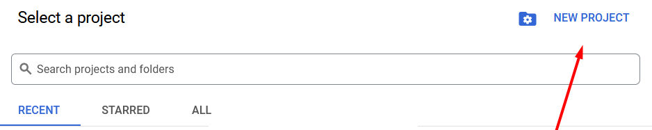
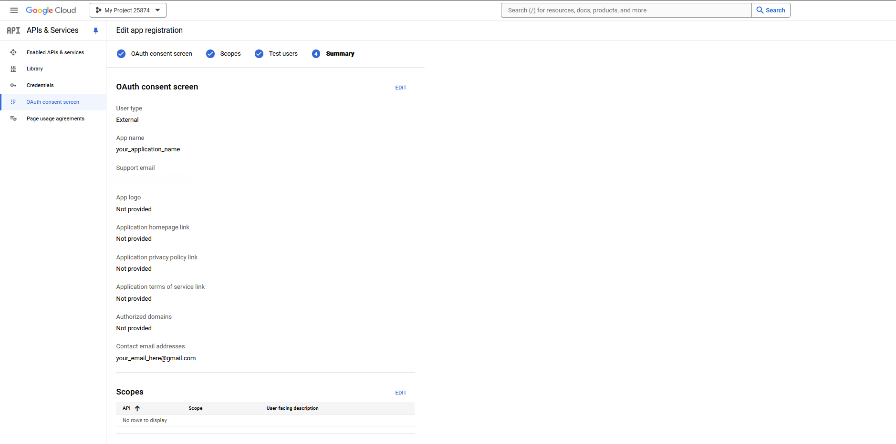
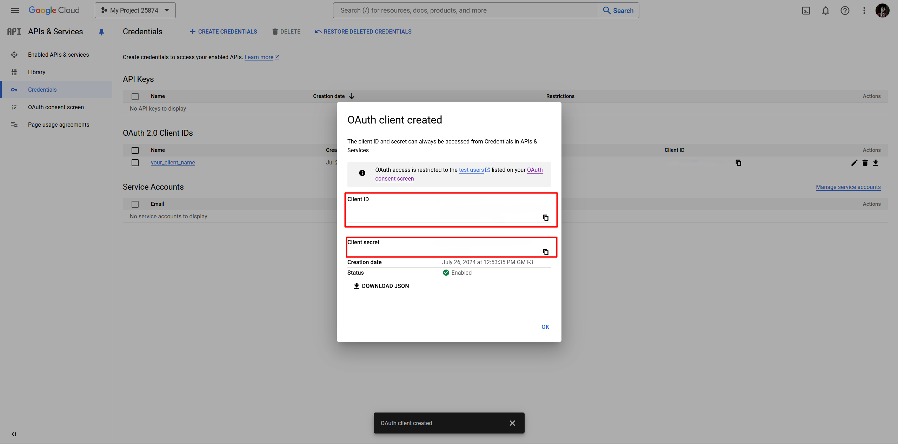
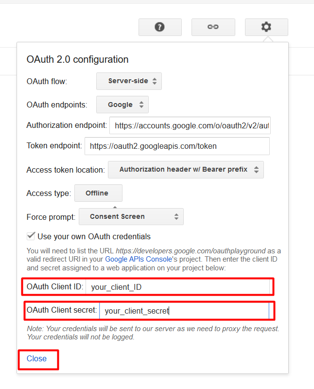

# Criando Seu Primeiro Projeto no Google Developer Cloud

## Passo a Passo

### 1. Acessar o Google Cloud Console

Acesse o site: [Google Cloud Console](https://console.cloud.google.com/).

### 2. Selecionar ou Criar um Projeto

- Clique em "Selecione um Projeto" ou, caso já tenha um, clique no nome do seu projeto.
  
  

- Clique em "Novo Projeto".
  
  

- Coloque o nome do seu projeto, organização (caso tenha uma) e clique em "Criar".
  
  

### 3. Configurar Tela de Consentimento OAuth

- Vá para "Credenciais" e clique em "Configurar Tela de Consentimento".
  
  

- Ative o modo "Externo" e clique em "Criar".
  
  

- Preencha suas credenciais para o App e clique em "Salvar e Continuar".
  
  
  
  

- O restante como Escopos, Usuários de teste e Resumo pode deixar como está e clicar em "Voltar Para o Painel".
  
  

- Vá para "Tela de Consentimento OAuth" e clique em "Publicar App" e, após isso, clique em "Confirmar".
  
  

### 4. Criar Credenciais OAuth

- Vá para "Credenciais" novamente e clique em "Criar Credenciais" e escolha "ID do Cliente do OAuth".
  
  

- Copie seu ID do Cliente e seu Segredo do Cliente e armazene em um local seguro, depois clique em "OK".
  
  

### 5. Usar OAuth Playground

- Acesse o [OAuth 2.0 Playground](https://developers.google.com/oauthplayground/).

- Autorize os seguintes escopos na primeira etapa:
  
  
  
  

- Certifique-se de ter todos os escopos necessários e clique em "Autorizar APIs".
  
  

- Escolha sua conta Google e clique em "Continuar".
  
  
  
  

- Você será redirecionado ao Playground e terá o seu Authorization Code. Clique em "Exchange authorization code for tokens" e copie o seu Access Token.
  
  

### 6. Usar o Access Token em Sua API

Use o Access Token obtido em sua API para autenticação e pronto!
  
  
